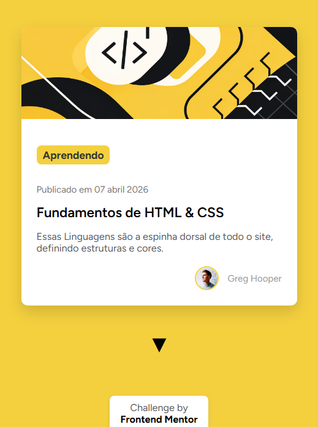
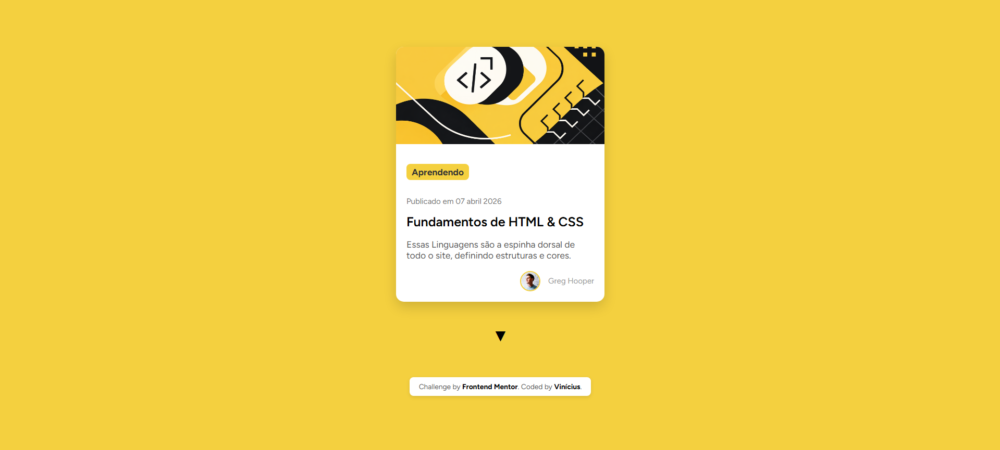

\# Cartão de Aprendizado

Projeto desenvolvido como desafio do [Frontend Mentor](https://www.frontendmentor.io).

Um card responsivo feito com \*\*HTML\*\* e \*\*CSS\*\*, aplicando boas práticas de layout, responsividade e animações.

\---

\## 📸 Preview



🔗 [Solução publicada no GitHub Pages](https://seuusuario.github.io/frontendmentor-card)

\---

\## 🚀 Tecnologias usadas

- HTML5
- CSS3 (Flexbox, Media Queries, Transições)
- Google Fonts (Figtree)

\---

\## 📚 O que aprendi

- Diferença entre `height: 100vh` e `min-height: 100vh` para evitar cortes em mobile.
- Como combinar múltiplos `transform` em uma única linha (`translateY` + `scale`).
- Uso correto de `gap` apenas em containers flex/grid.
- Evitar `position: fixed` em rodapés para não quebrar no mobile.
- Pensar em \*\*mobile-first\*\* e ajustar com media queries.

\---

\## 🛠️ Como usar

1. Clone este repositório:

\```bash

git clone https://github.com/seuusuario/frontendmentor-card.git
